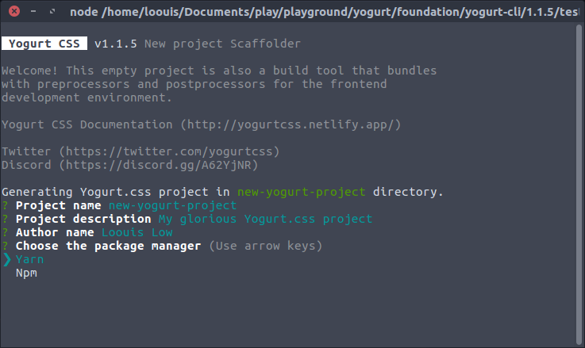

## CLI

Create a new frontend project with [Yogurt CSS](https://github.com/yogurt-foundation/yogurt-css) framework and scaffolding instantly bundles with necessary build tools for HTML, CSS/SCSS, JS and image assets.

<p align="center">
  
</p>

### _usage

make sure you have [npx](https://www.npmjs.com/package/npx) installed,

```bash
$ npx create-yogurt-app my-new-project
$ cd my-new-project
```

or with [yarn](https://yarnpkg.com/en/),

```bash
$ yarn create yogurt-app my-new-project
$ cd my-new-project
```

### _setup

scaffolding your new app files and build the app for the first time,

```bash
$ yarn build-dev
```

### _dev

serve and develop your frontend project,

```bash
$ yarn watch
```

---

[MIT](https://github.com/yogurt-foundation/create-yogurt-app/blob/master/LICENSE)
